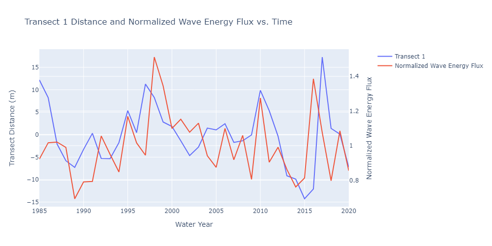

# California's Changing Coastlines - An Analysis of Displacement Factors and Trends 

Pacific Collegiate School\
Multivariable Calculus Class of 2023

### Abstract
Our primary question is: how do wildfires affect shoreline position? We seek to answer this question through understanding, visualizing, and utilizing Stepwise Multiple Linear Regression (MLR) to evaluate the relationship between wildfires and shoreline change. Climate change leads to increased frequency and severity of wildfires and precipitation which increases fluvial sediment discharge and therefore increases sediment inputs in littoral cells, causing beach expansion.  Our approach includes building a model using MLR which not only factors in wildfires but also includes other factors such as wave direction, wave power, among others to gain a broader understanding of shoreline change. Through our paper, it is our hope that we can leverage the existing tools and data to both reinforce existing understandings of how climate change is affecting California's coastal regions, as well as develop a more robust and intuitive interpretation of coastal developments. 

### Background
At all times the coastlines around the globe are impacted by innumerable environmental factors like seasonal currents, sediment discharge, and biological cycles. These influences place our coastlines in a perpetual and often periodic tug of war for ground against the elements. A developed understanding of these coastal behaviors allows for regions to better predict and address environmental threats to infrastructure, coastal communities, and ecosystems. And it has historically been the role of national agencies like the United States Geological Survey (USGS) to track the seasonal cycles of Coastline expansion and contractions via ground-based observations; often imploring the use of technology like GPS and LIDAR to meticulously track coastline positions throughout the year. With the development of satellite imaging technology and a general abundance of coastline imaging data, satellites have allowed the USGS and similar agencies to create shoreline modeling tools like the Coastal Storm Modelling System(CoSMoS). Patrick Barnard, a USGS research geologist, says, "Satellite data provides the opportunity to build a consistent approach that's robust and data tested, with hundreds to thousands of data points in every location, all without having to spend the time and money to travel and work on site". The vast amounts of data accumulated under the Landsat Program, a joint NASA & USGS Earth observing satellite campaign, has provided the means for developing new climate change prediction models such as CoSMoS and CoastSat. In recent years, California has seen an increase in the frequency and severity of climate events such as wildfires, downpours, and subsequent flooding. These coast and climate observation tools have proven paramount to understanding the ways in which recent climate trends have come to impact coastal ecosystems and communities. In order to do so, we began looking at several coastal sites up and down California's coast and eventually settled on a beach in Big Sur(Andrew Molera Beach) with close proximity to a river mouth. This site in recent years has experienced increased fluvial sediment discharge, a development closely correlated with joint rain and wildfire-based erosion. These climate-based coastal contractions and expansions at this particular site have designated this beach as our choice candidate to develop our understanding of climate-induced coastal change.

### Data Overview
The coastline position data was provided by CoastSat, an open-source software toolkit for obtaining time series of shoreline positions from 30+ years of satellite imagery. There are 18 different transects superimposed on satellite imagery of the Big Sur River beach (Andrew Molera Beach), with each having a specific location (latitude and longitude). Data consists of the current beach location with respect to its median along the transect (positive meaning outward, negative meaning inland, and 0 being the median position). The 18 transects are displayed as dots in the image below. A sample of the transect position data is also included below.

For independent variables, sediment discharge, wave energy flux, and wave direction were analyzed. Annual suspended sediment $Q_{ss} = mP^{n}F_{f}(t)$ is a function of precipitation (P), fire factor (Ff(t)), and m and n coefficients. The full derivation of this annual sediment yield model can be found in Warrick et al. (2013). Wave energy flux $F_{wave} = \frac{pg^{2}H_{s}^{2}T_{av}}{64\pi}$ is a function of seawater density (p), gravity (g), wave height (Hs), and wave period (T). Wave direction measurements were obtained from the National Data Buoy Center’s (NDBC) Cape San Martin buoy (Station 46,028; 35.770° N 121.903° W). 

### Methods
In order to prove the wildfires were responsible for shoreline changes, the assumption was made that sediment discharge is directly proportional to wildfire occurrence (shown in above equations). Furthermore, to prove the wildfires are correlated with coastline expansion and contraction, it is necessary to compare the impact wildfires have had on the shoreline, as well as the effect that factors such as wave power, wave direction have on coastal segments.
With that being said, before moving into a multivariate approach, it is helpful to first understand how we may implore a single variable comparison.

### A Single Variable Comparison
Our evaluation of the factors influencing shoreline position began by comparing sediment discharge & wave power to transect distance. These correlation analyses were made with annual measurements of the two independent variables(wave power & sediment discharge) and a dependent variable(transect distance) for a given transect 100m from the river mouth between 1985 - 2020. 

Then, generating correlation values for sediment discharge and wave power with shoreline position using the Pearson correlation coefficient, $r = \frac{n\Sigma xy-\Sigma x\Sigma y}{\sqrt{(n\Sigma x^2 - (\Sigma x)^2)(n \Sigma y^2 - (\Sigma y)^2)}}$ , we arrived at the following:

Transect 1 correlation values:

While on the aggregate, correlations (r) between these variables and shoreline positions were weak, suggesting no single external variable was responsible for the given variance, a deeper analysis of individual transects tells a different story. For transect 1 (100m), there is a positive correlation (r = 0.53).

If we take the log of sediment discharge, this correlation increases (r = 0.7). 

While initially promising, this is simply due to the influence of the river mouth adjacent to Molera Point as demonstrated by transects further down the beach, such as Transect 1800m, exhibiting a weak negative correlation. 
Transect 18 correlation values:

