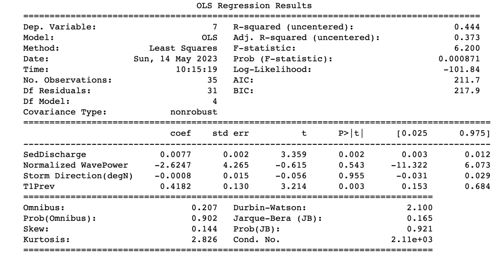

# California's Changing Coastlines - An Analysis of Displacement Factors and Trends 

Pacific Collegiate School\
Multivariable Calculus Class of 2023

### Abstract
Our primary question is: how do wildfires affect shoreline position? We seek to answer this question through understanding, visualizing, and utilizing Stepwise Multiple Linear Regression (MLR) to evaluate the relationship between wildfires and shoreline change. Climate change leads to increased frequency and severity of wildfires and precipitation which increases fluvial sediment discharge and therefore increases sediment inputs in littoral cells, causing beach expansion.  Our approach includes building a model using MLR which not only factors in wildfires but also includes other factors such as wave direction, wave power, among others to gain a broader understanding of shoreline change. Through our paper, it is our hope that we can leverage the existing tools and data to both reinforce existing understandings of how climate change is affecting California's coastal regions, as well as develop a more robust and intuitive interpretation of coastal developments. 

### Background
At all times the coastlines around the globe are impacted by innumerable environmental factors like seasonal currents, sediment discharge, and biological cycles. These influences place our coastlines in a perpetual and often periodic tug of war for ground against the elements. A developed understanding of these coastal behaviors allows for regions to better predict and address environmental threats to infrastructure, coastal communities, and ecosystems. And it has historically been the role of national agencies like the United States Geological Survey (USGS) to track the seasonal cycles of Coastline expansion and contractions via ground-based observations; often imploring the use of technology like GPS and LIDAR to meticulously track coastline positions throughout the year. With the development of satellite imaging technology and a general abundance of coastline imaging data, satellites have allowed the USGS and similar agencies to create shoreline modeling tools like the Coastal Storm Modelling System(CoSMoS). Patrick Barnard, a USGS research geologist, says, "Satellite data provides the opportunity to build a consistent approach that's robust and data tested, with hundreds to thousands of data points in every location, all without having to spend the time and money to travel and work on site". The vast amounts of data accumulated under the Landsat Program, a joint NASA & USGS Earth observing satellite campaign, has provided the means for developing new climate change prediction models such as CoSMoS and CoastSat. In recent years, California has seen an increase in the frequency and severity of climate events such as wildfires, downpours, and subsequent flooding. These coast and climate observation tools have proven paramount to understanding the ways in which recent climate trends have come to impact coastal ecosystems and communities. In order to do so, we began looking at several coastal sites up and down California's coast and eventually settled on a beach in Big Sur(Andrew Molera Beach) with close proximity to a river mouth. This site in recent years has experienced increased fluvial sediment discharge, a development closely correlated with joint rain and wildfire-based erosion. These climate-based coastal contractions and expansions at this particular site have designated this beach as our choice candidate to develop our understanding of climate-induced coastal change.

### Data Overview
The coastline position data was provided by CoastSat, an open-source software toolkit for obtaining time series of shoreline positions from 30+ years of satellite imagery. There are 18 different transects superimposed on satellite imagery of the Big Sur River beach (Andrew Molera Beach), with each having a specific location (latitude and longitude). Data consists of the current beach location with respect to its median along the transect (positive meaning outward, negative meaning inland, and 0 being the median position). The 18 transects are displayed as dots in the image below. A sample of the transect position data is also included below.

For independent variables, sediment discharge, wave energy flux, and wave direction were analyzed. Annual suspended sediment $Q_{ss} = mP^{n}F_{f}(t)$ is a function of precipitation (P), fire factor (Ff(t)), and m and n coefficients. The full derivation of this annual sediment yield model can be found in Warrick et al. (2013). Wave energy flux $F_{wave} = \frac{pg^{2}H_{s}^{2}T_{av}}{64\pi}$ is a function of seawater density (p), gravity (g), wave height (Hs), and wave period (T). Wave direction measurements were obtained from the National Data Buoy Center’s (NDBC) Cape San Martin buoy (Station 46,028; 35.770° N 121.903° W). 

### Methods
In order to prove the wildfires were responsible for shoreline changes, the assumption was made that sediment discharge is directly proportional to wildfire occurrence (shown in above equations). Furthermore, to prove the wildfires are correlated with coastline expansion and contraction, it is necessary to compare the impact wildfires have had on the shoreline, as well as the effect that factors such as wave power, wave direction have on coastal segments.
With that being said, before moving into a multivariate approach, it is helpful to first understand how we may implore a single variable comparison.

### A Single Variable Comparison
Our evaluation of the factors influencing shoreline position began by comparing sediment discharge & wave power to transect distance. These correlation analyses were made with annual measurements of the two independent variables(wave power & sediment discharge) and a dependent variable(transect distance) for a given transect 100m from the river mouth between 1985 - 2020. 

Then, generating correlation values for sediment discharge and wave power with shoreline position using the Pearson correlation coefficient, $r = \frac{n\Sigma xy-\Sigma x\Sigma y}{\sqrt{(n\Sigma x^2 - (\Sigma x)^2)(n \Sigma y^2 - (\Sigma y)^2)}}$ , we arrived at the following.

Transect 1 correlation values:

While on the aggregate, correlations (r) between these variables and shoreline positions were weak, suggesting no single external variable was responsible for the given variance, a deeper analysis of individual transects tells a different story. For transect 1 (100m), there is a positive correlation (r = 0.53).

If we take the log of sediment discharge, this correlation increases (r = 0.7). 

While initially promising, this is simply due to the influence of the river mouth adjacent to Molera Point as demonstrated by transects further down the beach, such as Transect 1800m, exhibiting a weak negative correlation. 

Transect 18 correlation values:

Evidently, a single variable approach is insufficient. With the assumption that wave flux, sediment discharge, wave direction, and past transect locations are directly related to shoreline position, a stepwise multiple linear regression would be the next appropriate approach.

### A Multivariable Comparison

$y = \beta_0 + \beta_1X_1 + ... + \beta_nX_n + \epsilon$

Above is an example of a multiple linear regression, where y is the dependent variable, and x1-xn are independent variables. In order to perform a multiple linear regression, the method of least squares is utilized, such that the sum of squares of the residuals is minimized (hence least squares). This can be done using matrices and linear algebra. An image of the residuals is displayed below, with the dotted lines representing the residual. 

In the image below, least squares are further explained. Ax is the “solution” to the least squares optimization problem, while b represents the data. Least squares refers to minimizing the square root of the sum of the squares of ax-b, or ||ax-b||. It turns out that b (the solution) isn’t present on the column space - this is because there isn’t a precise or exact solution to this problem (it is an approximation). Instead, the closest approximation of b is a projection of the vector b onto the column space. This projection yields an equation that involves multiplying matrices and various other operations, which yields the regression coefficients to minimize the squares of the residuals, hence least squares. 

### Visualizing Multiple Linear Regression
With only two independent variables (in the multiple linear regression equation), this forms the equation y = a + bx1 + cx2, which is the equation of a plane (Z = ax + by + c). Shown in the graph below, Transect distance is measured as a function of sediment discharge and wave power, and a multiple linear regression is performed to find the plane of best fit for the data. 

In this way, multiple linear regression with just two independent variables, as is present for many of the transects, is simply finding a plane of best fit for the data. One question encountered is: why not minimize the absolute value of the residuals opposed to minimizing the sum of the squares of the residuals? To answer this, larger gaps within the data are factored more by summing the squares of the residuals. This begs the question: why not use the residuals to the fourth power? To answer this second question, although the larger gaps must be prioritized, it is essential they must not completely eclipse smaller differences in the data. 

Multiple linear regression can be expanded to more than just 2 independent variables using a programming tool. First, the variables that are in fact correlated with the transect distance changes are identified using an alpha of 0.05 (standard scientific alpha). Next, these variables are utilized to generate coefficients for a multiple linear regression. At this step, a couple of statistical factors must be considered: the independent variables must not be correlated, the residuals must display a normal distribution, and the independent variables must contribute to unique variation in the data. 

Furthermore, there are different ways to perform stepwise multiple linear regression, such as backwards, forwards, etc. The “Forwards” regression includes building a model by gradually adding on new variables. The “Backwards” regression works by starting with all variables considered and subtracting variables sequentially. Stepwise multiple linear regression is a branch of forward selection, but differs in that variables that later become insignificant are removed. Jon (at USGS) utilized stepwise multiple linear regression, while in this paper, backwards stepwise regression was utilized. An image of the program output below shows 4 independent variables (sediment discharge, normalized wave power, storm direction(degN), and the previous position of the transect. 

What is a p-value? A p-value, in statistics is the probability of obtaining a sample more extreme than the ones observed in your data assuming the null hypothesis is true. Using backward multiple linear regression, all independent variables are originally considered. Independent variables whose p values exceed the alpha threshold mentioned above (0.05) will be removed, and only statistically significant variables will remain. This is similar to the chi-square distribution table, in that 95% or a p-value less than 0.05 is sufficient to reject the null hypothesis. Similarly, in the multiple linear regression model, the p-values that exceed 0.05 are not sufficient to reject the null hypothesis. 

### Validating Past Work
To validate past work, the first step is confirming linear relationships between dependent and independent variables (shown below). “T1” represents the first transect (100m from the rivermouth). Only a couple of the independent variables are shown in the image below, however all of them were validated. 

Next, the 5 independent variables (wave direction, wave flux, 1yr ago sediment discharge, current sediment discharge, and previous position of the transect) and dependent variable (transect distance) are plugged into the model. The results of the multiple linear regression are displayed below (left is past work and right is our results). Each horizontal bar represents a different transect. The x -axis is the r squared or correlation between the regression and the actual data. The colors represent the components of the r squared that each variable contributed to. 

As seen above, the results of the first transect match the single variable correlation (pearson’s coefficient) (from section entitled single variable approach) for river sediment, as the correlation was approximately .7 in the single variable approach, and as .7^2 = .49 and as it is seen that river sediment makes up approximately .49 of the r^2 value, this checks out. For the most part, our analysis validated the previous work, with the exception of transects 6 and 14, in which slightly different results are seen. This could be due to our analysis considering a slightly shorter timeline, because we performed a backwards regression, while past work utilized a stepwise regression. 

An additional confirmation that the model utilized is correctly modeling the shoreline is shown below, where transect 17’s regression coefficients are displayed. Note that wave_flux is negative, indicating that as wave power increases, transect position decreases (beaches get smaller.) This makes sense, because with greater wave power, one would expect more sediment to be transported out of the littoral cell. 

### Expanding on Previous Work
Additional variables that were tested include but were not limited to: previous years sediment discharge (up to 5 years prior), adjacent shoreline position, and wave height. When adjacent shoreline positions were factored into the model, they displaced sediment discharge, as they were more highly correlated with the transect position than was sediment discharge. Additionally, previous sediment discharge likewise displaced current sediment discharge (specifically for transects close to the river mouth) as the most correlated variable, which goes against the common consensus about sediment flow. One factor considered was an approximation of the sediment discharge from 6 months ago (averaging the sediment from the previous and current year,) and originally, it was expected that this sediment discharge data would correlate with transects 8-15, presuming the sediment is flowing down the coast over the course of a year. However, the 6-month-old sediment discharge data not only fitted transects 8-15, but also replaced sediment discharge (current) as the dominant variable for the first 8 transects, meaning it had to be removed. 

To obtain the data on wave height, data from the Cape San Juan Martin Buoy was utilized. 

This data was downloaded, and because it was in the form of periodic observations approximately daily, the data was averaged annually before being analyzed in the multiple linear regression models. 

The above image is from data from the buoy from 1983, and shows wind speed, wave height, as well as year, month, day, and time for many observations. In previous work, only observations made from October 1 - March 30 (winter wave flux) were considered, however in the analysis in this paper, the entire year’s average wave height was factored into the model. After plugging average wave height and average wave height squared into the MLR model, neither showed a strong correlation with shoreline position. 

 Next, data from the point sur buoy, a buoy closer to the location of the beach in question was tested. However, the point sur buoy didn’t yield consistent results either, probably due to only having 12 years of available data as opposed to 40. 

In all, none of the additional variables tested provided sufficient new information to greatly improve the r squared values. 

### Sources of Error/Critiques  
As mentioned later in the discussion, finding data by the month would likely improve the r squared value, because wave power runs on more of a monthly instead of yearly cycle, with greater waves in the winter time. Thus aggregating data yearly is one source of error. Another source of error is that the Cape San Martin buoy’s records of wave height, period, and average wave height were inaccurate as it is located off of the coast. Others included improper data collection, erroneous bugs in programs utilized/borrowed, significant figures that are inaccurate (satellite data had a 10m error rate,) and confirmation bias, among others. 

### Discussion
As shown by the results of the multiple backwards linear regression (the work in this paper) and stepwise linear regression (from past work) alike, there appears to be a strong correlation between shoreline position and sediment discharge through the first 6 transects, and a marginally weaker correlation between shoreline position and sediment discharge (with a 1 year lag)  for the latter half of the transects. This makes sense, because it is explained by the fact that sediment travels southwards over time, down the coast after being deposited at the river mouth (transect 1). 

Because the data suggest that sediment discharge does in fact correlate with and influence shoreline position, by extension, wildfires and precipitation (factors of sediment discharge) were responsible for the change in the coastline. Contextualized within the larger discussion of climate change influencing ecosystems (specifically coastal ones), beach expansion (from climate change causing more fires) may seem counterintuitive, as sea level rise is typically associated with climate change, and would lead to smaller beaches. However, evidenced by the beaches of Big Sur among others, currently, sediment entering littoral cells (fluvial in this case and due to fires) is greater than the sediment exiting littoral cells (potentially due to sea level rise and greater waves), contributing to beach expansion. 

Regardless of the differing impacts of climate change, one thing is clear - shoreline position will be changing and varying at a greater rate. With the increased frequency of fires and flood events due to climate change, and given their correlation to shoreline position change (established in this paper,) shoreline recreation and ecosystems will be disrupted and altered at a greater rate. 

Looking forward, to further explore the relationship between fire and flood events to shoreline position change, evaluating the correlation between sediment discharge, wave direction, wave power, and shoreline position on a monthly basis instead of a yearly one would be informative. Additionally, using non-linear regression models would be insightful. 

### References 
1. Choueiry, G. (2019, October 26). Understand Forward and Backward Stepwise Regression. https://quantifyinghealth.com/stepwise-selection/
2. CoastSat. (2022, December 1). Water Research Laboratory. https://www.wrl.unsw.edu.au/research/coastsat
3. De Baecke, M. (2022, February 4). The Least Squares Method - Cantor’s Paradise. Medium. https://www.cantorsparadise.com/the-least-squares-method-82aaf34a8b26
4. Example of Multiple Linear Regression in Python. (n.d.). https://datatofish.com/multiple-linear-regression-python/
5. Harris, D. (2022, May 2). Why some beaches are getting bigger despite rising sea levels. Phys. Retrieved May 24, 2023, from https://phys.org/news/2022-05-beaches-bigger-sea.html
6. Kwok, R. (2022, January 7). Stepwise Regression Tutorial in Python - Towards Data Science. Medium. https://towardsdatascience.com/stepwise-regression-tutorial-in-python-ebf7c782c922
7. Vos, K., Splinter, K. D., Harley, M. D., Simmons, J. A., & Turner, I. (2019). CoastSat: A Google Earth Engine-enabled Python toolkit to extract shorelines from publicly available satellite imagery. Environmental Modelling and Software, 122, 104528. https://doi.org/10.1016/j.envsoft.2019.104528
8. Warrick, J. A., Vos, K., East, A. E., & Vitousek, S. (2022). Fire (plus) flood (equals) beach: coastal response to an exceptional river sediment discharge event. Scientific Reports, 12(1). https://doi.org/10.1038/s41598-022-07209-0

